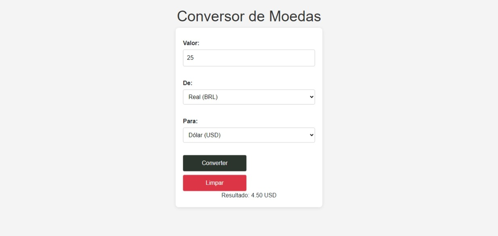

<h1 align="center"> Conversor de Moedas 🌎💸</h1>
Este é um projeto de Conversor de Moedas desenvolvido em HTML, CSS e JavaScript, com auxílio do framework Bootstrap para estilização. Ele permite que os usuários convertam valores entre diferentes moedas, como Real (BRL), Dólar (USD) e Euro (EUR), com uma interface intuitiva e fácil de usar.
🖼️ Demonstração
<p align="center">  </p>

<h1 align="center"> ✨ Funcionalidades</h1>
* Conversão de Moedas: O usuário pode inserir um valor, escolher a moeda de origem e a moeda de destino para realizar a conversão.
* Design Responsivo: A interface utiliza Bootstrap, proporcionando uma experiência visual agradável e responsiva.
* Botões de Converter e Limpar: O botão "Converter" realiza a conversão, enquanto o botão "Limpar" reinicia os campos.
<h1 align="center"> 🗂️ Estrutura de Arquivos</h1>
* O projeto é composto pelos seguintes arquivos:<br>

```index.html: Arquivo principal com o formulário e a interface de usuário.```<br>
```style.css: Arquivo de estilo personalizado para o projeto.```<br>
``main.js: Arquivo de script JavaScript que contém a lógica de conversão.``
<h1 align="center"> 💡 Funcionalidade de Conversão</h1>
No arquivo main.js, é implementada uma função que obtém o valor inserido, a moeda de origem e a moeda de destino, realiza a conversão com base em taxas pré-definidas ou dinâmicas (caso o projeto seja conectado a uma API externa) e exibe o resultado na página.
# colaborador e autor
 [<br><sub>Maria Yanagui<br> </sub>](https://github.com/mariayanagui) |  [<br><sub>Guilherme Serfim<br></sub>](https://github.com/Guilimas2) |  [<br><sub></sub>](h) 
